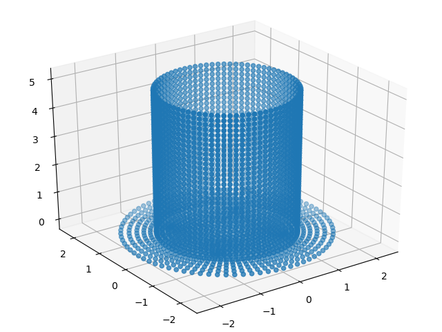

# K file reader
LS Dyna input file is a .k file called key file

more info on k file [here](https://kth.instructure.com/courses/6376/files/1398637/download?verifier=vKYrSZc7FmwSxnsJbH6QYX0fb8lTc2UXjszIKX6I&wrap=1)





# Install
pip install kreader


# Demo

```python

from kreader import readKfile, plotNodes

elem, nodes = readKfile(fname)
plotNodes(nodes)


```
